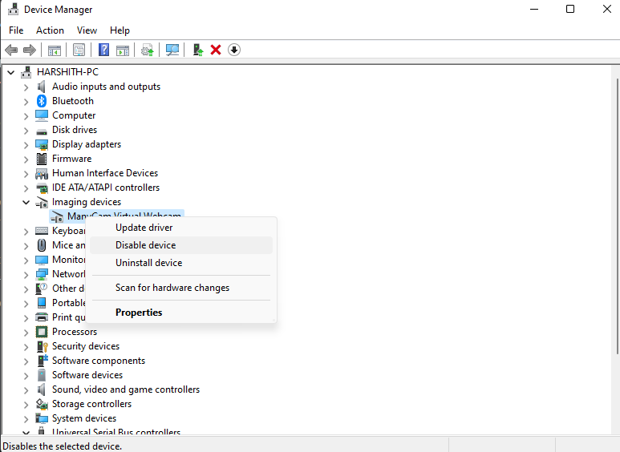

# Disable Camera
This is rather easy tutorial, and currently only for Windows users.

## Steps
- Click search and open Device Manager on your PC.

- Open Device Manager, go to Imaging Devices, and disable your camera by right cliking on it, and clicking the Disable option

That's it. You've succesfully disabled your camera.
Now the site will not ask for your camera, but you'll have to give it permission though.

### In case of any issues, post your issue with detailed info on the issues tab.
