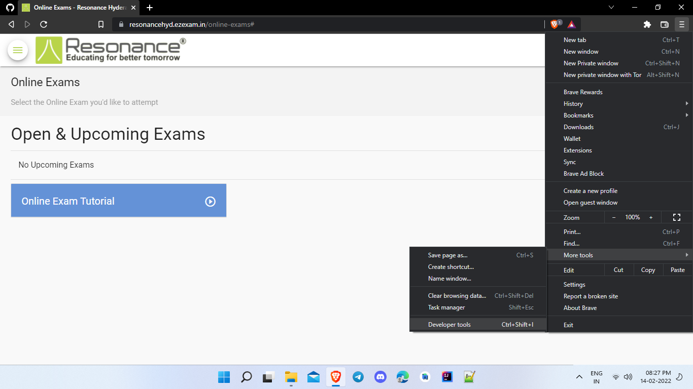
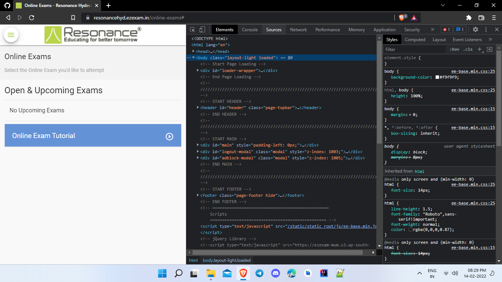
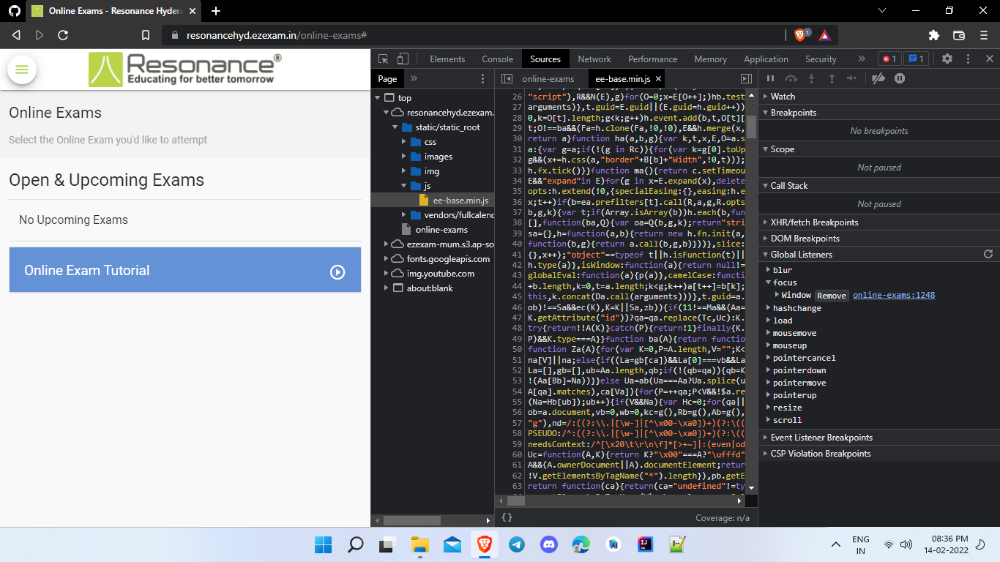
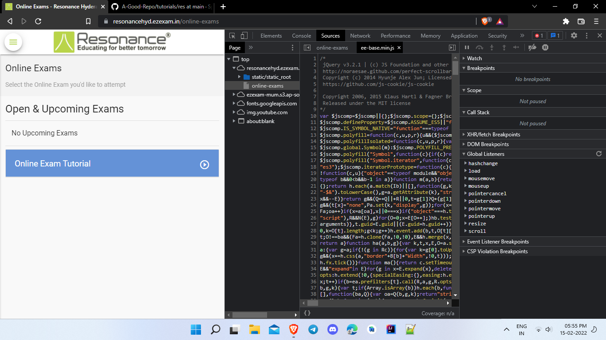

## Bypassing the website's security mechanism, that detects the tab/window changes
Don't be scared looking at the pics. This one's gonna be easy too, even if you know nothing about Web Development.

## Steps
- Open the exam page's tab and open Developer Tools in your browser by using the shortcut "Ctrl+Shift+I" or using the menu, as shown in the pic.
- Note: This tutorial is for Chromium based browsers. i.e., Google Chrome, Chromium, Brave, Microsoft Edge, etc...

- Now, once you've opened the Developer Tools, go to the Sources tab

- Now, open ee-base.min.js by double clicking the items as static/static_root/js/ee-base.min.js

- Now, you should see Global Listeners tab on the right side of the JS code. Open it.
- In it, open focus tab, and click remove for the "Window" option.
- Now you'll see that the focus tab disappeared.

### Congo!
You've successfully removed the focus listener for the site. And again, report issues if any occur.
